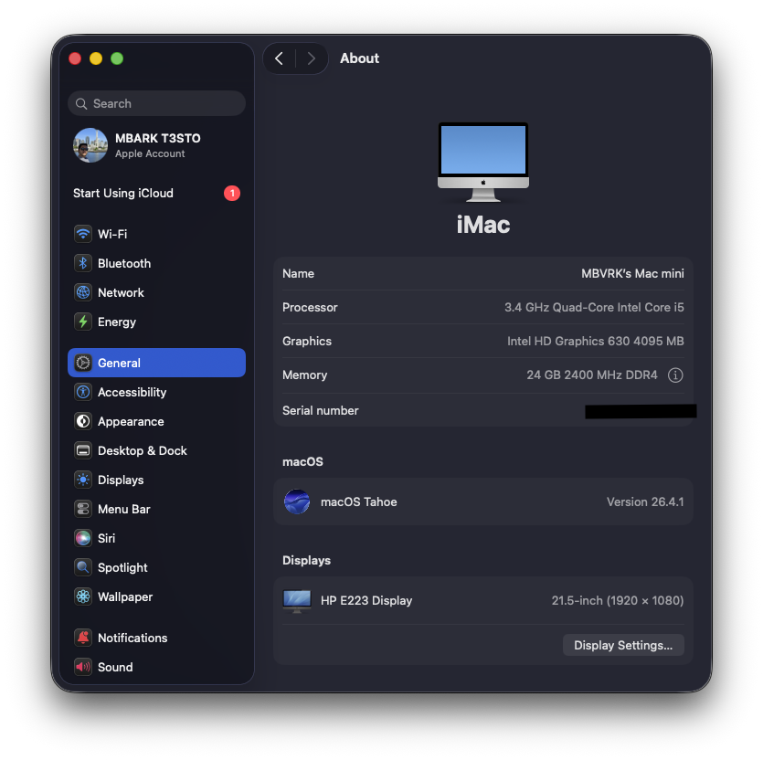
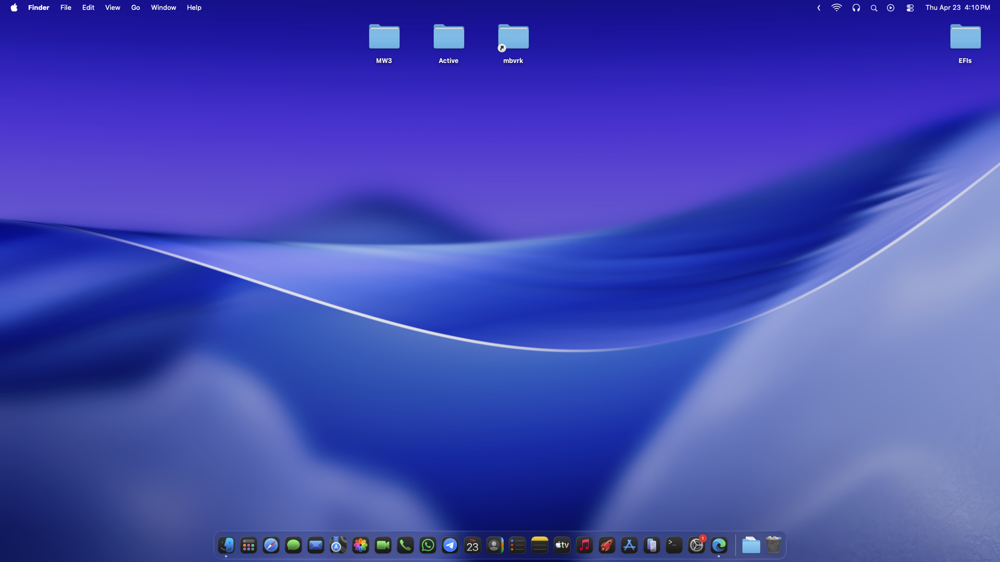
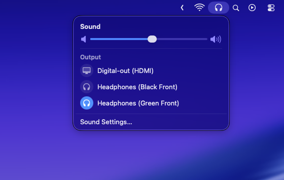
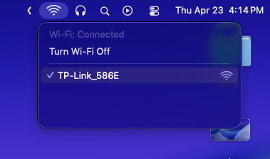
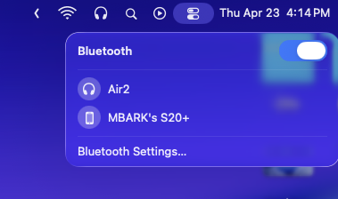
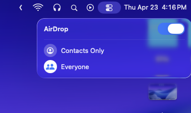

# 🖥️ HP EliteDesk 800 G3 DW 65W - macOS Tahoe Hackintosh EFI

<div align="center">


**A complete and optimized EFI configuration for running macOS Tahoe on HP EliteDesk 800 G3 DW 65W**

[Screenshots](#-screenshots) • [Installation](#-installation) • [What Works](#-what-works) • [Configuration](#-configuration) • [Credits](#-credits)

</div>

---

## 📋 System Specifications

| Component | Details |
|-----------|---------|
| **Model** | HP EliteDesk 800 G3 Desktop Mini 65W |
| **CPU** | Intel 7th Gen (Kaby Lake) |
| **iGPU** | Intel HD Graphics 630 |
| **Audio** | Realtek ALC221 |
| **Ethernet** | Intel I219-LM |
| **Wi-Fi** | Intel Wireless (with itlwm) |
| **Bluetooth** | Intel Bluetooth |
| **SMBIOS** | iMac18,1 |
| **OpenCore** | 1.0.3 |

## ✅ What Works

### 🎯 Fully Functional
- ✅ **macOS Tahoe** - Complete installation and updates
- ✅ **Intel HD Graphics 630** - Full hardware acceleration with Metal support
- ✅ **Audio** - Realtek ALC221 with layout-id 20
- ✅ **Ethernet** - Intel I219-LM with full speed
- ✅ **Wi-Fi** - Intel wireless with itlwm driver
- ✅ **Bluetooth** - Intel Bluetooth with full functionality
- ✅ **USB Ports** - All ports mapped and working
- ✅ **Sleep/Wake** - Proper power management
- ✅ **NVME SSD** - Full support with power management
- ✅ **Hardware Monitoring** - Temperature and fan sensors
- ✅ **AirDrop** - Working with Intel wireless
- ✅ **Continuity Features** - Handoff, Universal Clipboard

### 🔧 Power Management
- ✅ **CPU Power Management** - Native XCPM with CPUFriend
- ✅ **GPU Power Management** - Proper P-states and frequency scaling
- ✅ **Sleep States** - S3 sleep support
- ✅ **Fan Control** - Automatic thermal management

## 📸 Screenshots

### System Information


### Desktop Environment


### Audio System


### Wi-Fi Connectivity


### Bluetooth Functionality


### AirDrop Working


## 🚀 Installation

### Prerequisites
- HP EliteDesk 800 G3 DW 65W
- USB drive (16GB or larger)
- macOS Tahoe installer
- Basic knowledge of Hackintosh installation

### BIOS Settings
Before installation, configure your BIOS with these settings:

#### Disable
- Secure Boot
- Fast Boot
- CSM/Legacy Boot
- Intel SGX
- CFG Lock (if available)

#### Enable
- UEFI Boot Mode
- SATA AHCI Mode
- Intel VT-x (if using virtualization)
- Above 4G Decoding (if available)

### Installation Steps

1. **Download this EFI**
   ```bash
   git clone https://github.com/yourusername/HP-EliteDesk-800-G3-DW-65W-Hackintosh.git
   ```

2. **Prepare USB Installer**
   - Create macOS Tahoe installer using [OpenCore Install Guide](https://dortania.github.io/OpenCore-Install-Guide/)
   - Replace the EFI folder with this repository's EFI

3. **Generate SMBIOS**
   - Use [GenSMBIOS](https://github.com/corpnewt/GenSMBIOS)
   - Generate new serials for `iMac18,1`
   - Update `config.plist` with your unique serials

4. **Install macOS**
   - Boot from USB installer
   - Follow standard macOS installation process
   - Copy EFI to your drive's EFI partition after installation

## ⚙️ Configuration Details

### ACPI Patches
- **SSDT-AWAC-HPET-RTC** - System clock and timer fixes
- **SSDT-PLUG** - CPU power management
- **SSDT-EC** - Embedded controller
- **SSDT-USBX** - USB power properties
- **SSDT-PMCR/PPMC** - Power management controller
- **SSDT-XOSI** - Windows compatibility layer

### Kexts Used
| Kext | Version | Purpose |
|------|---------|---------|
| **Lilu** | 1.7.1 | Patch engine |
| **VirtualSMC** | 1.3.7 | SMC emulation |
| **AppleALC** | 1.9.7 | Audio driver |
| **WhateverGreen** | 1.7.0 | Graphics patches |
| **IntelMausiEthernet** | 2.5.5d0 | Ethernet driver |
| **itlwm** | 2.3.0 | Intel Wi-Fi driver |
| **IntelBluetoothFirmware** | 2.5.0 | Bluetooth firmware |
| **BlueToolFixup** | 2.7.1 | Bluetooth compatibility |
| **USBToolBox** | 1.1.1 | USB enhancement |
| **NVMeFix** | 1.1.3 | NVMe power management |
| **RestrictEvents** | 1.1.7 | System restrictions bypass |
| **FeatureUnlock** | 1.1.9 | macOS feature enabler |
| **CPUFriend** | 1.2.8 | CPU power management |
| **SMC Sensors** | 1.3.7 | Hardware monitoring |

### Boot Arguments
```
alcid=20 igfxrpsc=1 igfxonln=1 igfxagdc=0 -ibtcompatbeta -lilubetaall igfxframe=0x591B0000 nvme=-p -xcpm net.inet.tcp.delayed_ack=0 igfxcdc=3 igfxdvmt=7 alcdelay=1000 alcverbs=1 darkwake=0 acpi_sleep=s3
```

### Device Properties
- **Audio Layout ID**: 20 (Realtek ALC221)
- **iGPU Platform ID**: 0x59120000 (Intel HD 630)
- **Framebuffer Patches**: Optimized for desktop use
- **USB Power Management**: Configured for all ports

## 🔧 Post-Installation

### Essential Steps
1. **Update SMBIOS** - Generate unique serials
2. **Enable Wi-Fi** - Install HeliPort for itlwm management
3. **Audio Setup** - Verify layout-id 20 is working
4. **USB Mapping** - Ports are pre-mapped but verify functionality
5. **Power Management** - Check CPU frequency scaling

### Recommended Tools
- **OpenCore Configurator** - EFI management
- **HeliPort** - Wi-Fi network management
- **HackinTool** - System information and patches
- **Kext Updater** - Keep kexts updated
- **IORegistryExplorer** - Hardware debugging

## 🛠️ Troubleshooting

### Common Issues

#### Audio Not Working
- Verify layout-id is set to 20
- Check AppleALC is loaded
- Reset NVRAM
- **Alternative Solution**: If AppleALC doesn't work, install VoodooHDA (VoodooHDA.pkg available in Assets folder)
  - Disable AppleALC in config.plist (but first try to not disable it)
  - Run the VoodooHDA.pkg installer from Assets folder
  - Reboot system after installation

#### Wi-Fi Issues
- Install HeliPort application
- Check itlwm kext is loaded
- Verify Intel wireless card compatibility

#### Graphics Glitches
- Verify WhateverGreen is loaded
- Check iGPU device properties
- Reset NVRAM and SMC

#### Sleep Issues
- Check ACPI patches are applied
- Verify USB power management
- Disable hibernation: `sudo pmset -a hibernatemode 0`

### Performance Optimization
```bash
# Disable hibernation
sudo pmset -a hibernatemode 0
sudo pmset -a standby 0
sudo pmset -a autopoweroff 0

# Optimize network performance
sudo sysctl -w net.inet.tcp.delayed_ack=0
```

## 📊 Benchmarks

### Geekbench 5 Scores
- **Single-Core**: ~1000-1200
- **Multi-Core**: ~3500-4000
- **Metal**: ~5000-6000

### Performance Notes
- Native CPU power management with proper P-states
- Full GPU acceleration for 4K video playback
- Excellent thermal management with quiet operation

## 🔄 Updates

### Keeping Your System Updated

1. **macOS Updates**
   - Regular system updates work normally
   - Always backup EFI before major updates

2. **OpenCore Updates**
   - Check releases regularly
   - Update kexts alongside OpenCore

3. **Kext Updates**
   - Monitor GitHub releases for kext updates
   - Test updates in safe environment first

## 🤝 Contributing

Contributions are welcome! Please:

1. Fork the repository
2. Create a feature branch
3. Test thoroughly on HP EliteDesk 800 G3 DW 65W
4. Submit a pull request with detailed description

### Reporting Issues
- Use the issue template
- Include system information
- Attach relevant logs
- Describe steps to reproduce

## 📄 License

This project is licensed under the MIT License - see the [LICENSE](LICENSE) file for details.

## ⚠️ Disclaimer

- This EFI is specifically configured for HP EliteDesk 800 G3 DW 65W
- Use at your own risk - always backup your data
- This is for educational purposes only
- macOS is a trademark of Apple Inc.

## 🙏 Credits

### Special Thanks
- **Acidanthera Team** - OpenCore and essential kexts
- **Dortania** - Comprehensive installation guides
- **OpenIntelWireless** - Intel Wi-Fi and Bluetooth drivers
- **RehabMan** - Legacy patches and guides
- **Hackintosh Community** - Continuous support and development

### Resources
- [OpenCore Install Guide](https://dortania.github.io/OpenCore-Install-Guide/)
- [OpenCore Documentation](https://github.com/acidanthera/OpenCorePkg/tree/master/Docs)
- [Hackintosh Paradise](https://hackintosh.com/)
- [tonymacx86 Forums](https://www.tonymacx86.com/)

---

<div align="center">

**If this EFI helped you, please ⭐ star this repository!**

Made with ❤️ for the Hackintosh community

</div>